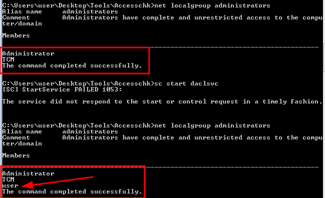

# 🛀 Service Permissions (Paths)

### Escalation via Binary Paths <a href="#lecture_heading" id="lecture_heading"></a>

first open this file in a cmd and type:

<figure><figcaption></figcaption></figure>

```
powershell -ep bypass
. .\PowerUp.ps1
Invoke-AllChecks
```

1. `powershell -ep bypass`: This command starts a PowerShell session with the execution policy set to bypass. The `-ep` parameter stands for "ExecutionPolicy" and allows you to specify the execution policy for the PowerShell session. Setting it to "bypass" allows scripts to run without any restrictions. This is often used when running scripts that may be blocked by more restrictive execution policies.
2. `. .\PowerUp.ps1`: This command executes a PowerShell script named "PowerUp.ps1" located in the current directory. The `.\` prefix specifies the current directory, and the `.` followed by a space before the script filename indicates that the script should be executed in the current session (rather than in a new session). This is known as "dot-sourcing" a script, which means the script's contents are executed within the current scope rather than in a separate scope.
3. `Invoke-AllChecks`: This command invokes a function or cmdlet named "Invoke-AllChecks". This command is likely a part of the "PowerUp.ps1" script that was dot-sourced in the previous step. The purpose of this command is to trigger the execution of a series of checks or tests within the script. These checks could be related to system configuration, security vulnerabilities, or other aspects of the system that the script is designed to assess.

This is very automatic, in a more manual way, you can cd to this directory:

```
cd \Desktop\Tools\Accesschk
accesschk64.exe -uwcv Everyone *
```

1. **accesschk64.exe**: This is an executable file, specifically for 64-bit Windows systems, that is part of the Sysinternals suite of tools developed by Microsoft. The `accesschk` tool is used to view the effective permissions for files, directories, registry keys, or other securable objects in Windows. In this case, `accesschk64.exe` specifically refers to the 64-bit version of the `accesschk` tool.
2. **-uwcv**: These are command-line options or switches that modify the behavior of the `accesschk64.exe` tool. Here's what each of them does:
   * `-u`: Specifies that the output should display user account names associated with the permissions.
   * `-w`: Specifies that the output should display only objects for which the specified user has write access.
   * `-c`: Specifies that the output should include containers, such as directories or registry keys, in addition to objects directly specified.
   * `-v`: Specifies that the output should be verbose, providing additional information about the permissions.
3. **Everyone**: This is a placeholder representing the user or group whose permissions are being checked. In this case, it refers to the "Everyone" group, which includes all user accounts, even those without explicit permission.
4. **\***: This wildcard character is used to specify the resource or object for which permissions are being checked. When used with `accesschk`, it typically means to check permissions for all objects that match the specified criteria. In this context, `*` could refer to all files, directories, registry keys, or other securable objects in the system.

<figure><figcaption><p>Manual method</p></figcaption></figure>

<figure><figcaption><p>Automatic method</p></figcaption></figure>

```
accesschk64.exe -wuvc daclsvc
```

<figure><figcaption></figcaption></figure>

we got read write for everyone as we can see

since we are part of the `everyone` groupe; we put it in our previous command, but we could've put in any group. Good thing to note is the `change_config` service that we can modify&#x20;

```
sc qc daclsvc
```

1. **sc**: This is the Service Control command-line utility in Windows. It allows you to communicate with the Service Control Manager and services.
2. **qc**: This is an abbreviation for "queryconfig". It instructs `sc` to display the configuration information for the specified service.
3. **daclsvc**: This is the name of the service for which you want to query the configuration information. In this case, it refers to a service named "daclsvc". Services in Windows are background processes that can be automatically started when the system boots or on demand.

<figure><figcaption></figcaption></figure>

We can see the binary path name, but since we have change\_config enabled we can modify this

```
sc config daclsvc binpath= "net localgroup administrators user /add"
```

and you can see that if we start daclsvc, we can see some changes:

```
net localgroup administrators
sc start daclsvc
net localgroup administrators 
```

<figure><figcaption></figcaption></figure>
