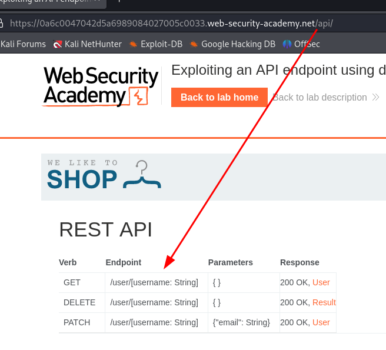
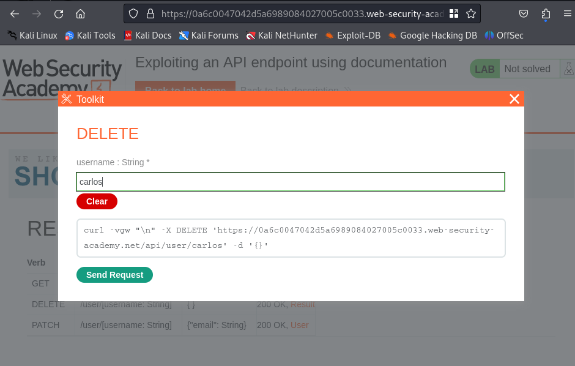

# 😙 API Testing

<figure><figcaption></figcaption></figure>

We need to start by identifying API endpoints.

```
GET /api/books HTTP/1.1
Host: example.com
```

The API endpoint for this request is `/api/books`

### Lab: Exploiting an API endpoint using documentation

We start by connecting with the credentials then modify the email address and capture the request:

<figure><figcaption></figcaption></figure>

We can't access carlos by abusing the path:

<figure><figcaption></figcaption></figure>

So we can access a different endpoint by modifying the request:

<figure><figcaption></figcaption></figure>

<figure><figcaption></figcaption></figure>

And we are able to access what seems to be possible requests to the API

if we click on delete, there is a popup that queries for us:

<figure><figcaption></figcaption></figure>

Or we could've done it through the Burp interface with a DELETE /api/user/carlos req

#### Identifying API endpoints

The HTTP method specifies the action to be performed on a resource. For example:

```
GET - Retrieves data from a resource.
PATCH - Applies partial changes to a resource.
OPTIONS - Retrieves information on the types of request methods that can be used on a resource.
```

### Lab: Finding and exploiting an unused API endpoint
