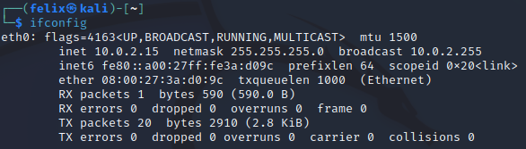

# ✍️ MAC Addresses

## Understanding MAC Addresses and ifconfig Command

### Introduction:

MAC (Media Access Control) addresses are unique identifiers associated with network interfaces. The `ifconfig` command provides information about MAC addresses among other network details.

#### Executing `ifconfig`:

```bash
ifconfig
```

This command reveals detailed information about network interfaces, including MAC addresses.

<figure><figcaption><p>The mac addresse is in the "ether" section of the output</p></figcaption></figure>

### MAC Address Type:

#### MAC Address (ether):

* **MAC addresses** are unique identifiers assigned to network interface controllers.
* In the `ifconfig` output, MAC addresses are denoted by the keyword **ether**.

#### Significance of MAC Addresses:

* **Layer 2 Connectivity:** MAC addresses operate at Layer 2 of the OSI model, facilitating communication within a local network.
* **Ethernet Frames:** Data sent within a local network is encapsulated within Ethernet frames containing source and destination MAC addresses.
* **Device Identification:** MAC addresses uniquely identify network interface controllers.

### MAC Address Structure:

* MAC addresses are typically represented in six pairs of hexadecimal characters, separated by colons.
* The first three pairs represent the manufacturer's identifier, and the last three pairs represent the unique identifier for the device.

#### Example:

My MAC address, based on the provided `ifconfig` output, is:

```bash
08:00:27
```

### Role of MAC Addresses:

MAC addresses play a vital role in Ethernet networks, enabling devices to communicate within a local area network (LAN). They are used by routers and switches to forward data to the appropriate destination based on the MAC address.

### Additional Insights:

* **Network Interface Controller (NIC):** The hardware component assigned a MAC address.
* **Layer 2 Switching:** MAC addresses are essential for Layer 2 switching, directing data within a LAN.

### Practical Use:

Understanding MAC addresses is crucial for network administrators, particularly in troubleshooting network issues, managing device connectivity, and ensuring the secure operation of local networks.

For a deeper exploration of MAC addresses and networking concepts, consider referring to official documentation or online tutorials.
