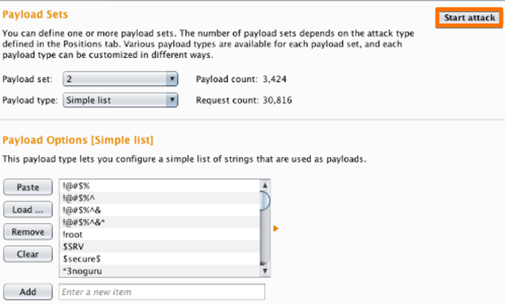

# 🤳 Credential Stuffing and Password Spraying

## Burp Suite Documentation: Intruder Tool

### Introduction

Burp Suite is a powerful set of cybersecurity tools designed for web application security testing. One of its key features is the **Intruder** tool, which allows users to automate and customize attacks on web applications to identify vulnerabilities. This documentation guides you through the process of using Burp Suite's Intruder tool to perform username and password enumeration.

1.  **Password Spraying:**

    * **Definition:** Password spraying involves attempting a few commonly used passwords against numerous usernames. Instead of a brute force attack with numerous password attempts for a single user, it's a more subtle approach with a limited number of attempts per user.
    * **Objective:** The goal is to avoid detection by not triggering account lockouts due to multiple failed login attempts.

    <figure><figcaption></figcaption></figure>
2.  **Credential Stuffing:**

    * **Definition:** Credential stuffing is a type of cyberattack where attackers use username and password combinations obtained from previous data breaches on other websites. They try these combinations on various online platforms, exploiting the fact that people often reuse passwords across multiple accounts.

    <figure><figcaption></figcaption></figure>

    * **Objective:** Attackers leverage the likelihood of users reusing passwords to gain unauthorized access to multiple accounts.

    <figure><figcaption></figcaption></figure>

### Prerequisites

Before using the Intruder tool, ensure that you have:

* Installed and configured Burp Suite.
* Basic knowledge of web application security concepts.

### Procedure

#### 1. Configure Burp Proxy

1. Open the [Burp Proxy](https://portswigger.net/burp/documentation/desktop/tools/proxy) tab.
2. Confirm that "Intercept is off."
3. Visit the login page of the target application in your browser.
4. Return to Burp.

#### 2. Enable Intercept

1.  In the [Proxy](https://portswigger.net/burp/documentation/desktop/tools/proxy) "Intercept" tab, turn on "Intercept."

    <figure><figcaption></figcaption></figure>
2.  Enter arbitrary details in the login page and submit the request.

    <figure><figcaption></figcaption></figure>
3. Captured requests appear in the "Intercept" tab.

#### 3. Send Request to Intruder

1. Right-click on the captured request.
2.  Select "Send to [Intruder](https://portswigger.net/burp/documentation/desktop/tools/intruder)."

    <figure><figcaption></figcaption></figure>

#### 4. Configure Intruder

1. In the [Intruder](https://portswigger.net/burp/documentation/desktop/tools/intruder) tab, go to "[Positions](https://portswigger.net/burp/help/intruder\_positions.html)" tab.
2. Add "username" and "password" as payload positions.
3.  Change the attack type to "Cluster bomb."

    <figure><figcaption></figcaption></figure>
4. Go to the "[Payloads](https://portswigger.net/burp/help/intruder\_payloads.html)" tab.

#### 5. Configure Payloads

1. In "Payload sets," set "Payload set" to "1" and "Payload type" to "Simple list."
2.  Enter possible usernames in the "Payload settings."

    <figure><figcaption></figcaption></figure>
3. Change "Payload set" to "2" and enter possible passwords.
4.  Click the "Start attack" button.

    <figure><figcaption></figcaption></figure>

#### 6. Analyze Results

Observe the responses for different status codes or lengths. Deviations may indicate breached credentials. View the attack window to examine response details.

<figure><figcaption></figcaption></figure>

#### 6. Advanced Analysis of Results

Burp Suite offers a powerful `grep` feature that enhances result analysis. Begin by examining the raw output and identifying a distinctive message, such as "error signing you in." Copy this specific error message and navigate to the `grep` feature located in the Intruder options. In the `grep match` section, paste the error message and clear the output box.

Upon restarting the attack, Burp Suite will efficiently filter and display every page that generates an error containing the specified message. This streamlined process allows you to quickly identify pages without the error message, streamlining the investigation process and pinpointing potential vulnerabilities in a more targeted manner.

<figure><figcaption></figcaption></figure>

Password spraying and credential stuffing is very common on external assessments, it's good to know.
